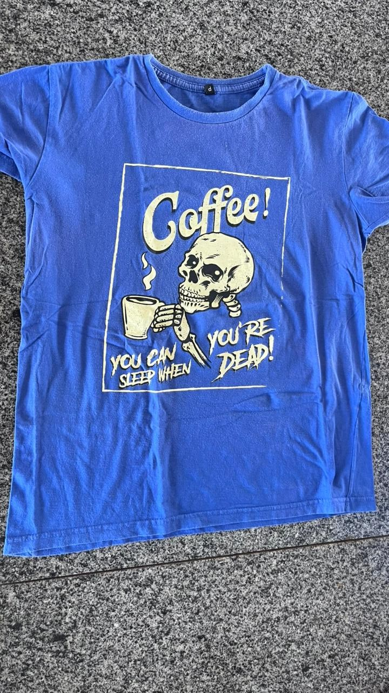

<html lang="pt-BR">
<head>
<meta charset="UTF-8">
<meta name="viewport" content="width=device-width, initial-scale=1.0">
<title>TiFashion - Produtos Sustentáveis</title>

</head>

<body>

<header>
    <h1>🌱 TiFashion</h1>
    
Por um planeta mais sustentável

</header>

<section class="produtos">

<!-- PRODUTO 1 -->

    

        
        
        
    

    

        
        
        
    

<!-- PRODUTO 2 -->

    

        
        
        
    

    

        
        
        
    

<!-- PRODUTOS 3 A 9 -->
<!-- repetidos já prontos com estrutura igual -->

    

        
        
        
    

    

        
        
        
    

    

        
        
        
    

    

        
        
        
    

    

        
        
        
    

    

        
        
        
    

    

        
        
        
        
    

    

        
        
        
        
        
        
    

    

        
        
        
    

    

        
        
        
    

    

        
        
        
    

    

        
        
        
    

    

        
        
        
    

    

        
        
        
    

</section>

<footer>
🌍 TiFashion | Cuidando do planeta, uma compra de cada vez.
</footer>

</body>
</html>
